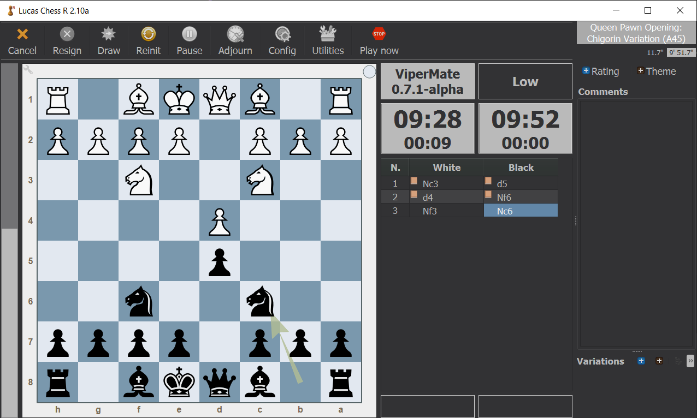

# ViperMate gets a UCI interface
*Date: November 11, 2023*

I finally added the UCI interface to ViperMate and it was a pleasure to play against the engine on a graphical interface for the first time.

Implementing the UCI code was not a particularly interesting task, nor do I consider the "protocol" to be very good or well defined, so my efforts to complete the task were not very compelling.

I still have to add support for some options and a lot of input validation. I'm sure the whole thing is full of bugs. But it works and I'm happy to have reached this important milestone.

I was so eager to finish the task and get the engine ready for use on a graphical interface that I only implemented a placeholder time management logic. At the moment ViperMate simply assigns 1/20 of the remaining time to each move, and I'll add more sophisticated criteria later.

There are some aspects of UCI that are not entirely clear to me, such as the ability to ask the engine to check for a specific number of nodes. I assume that adding this feature would force the engine to do a check at every node, and at the moment I don't like the idea for performance reasons. I'm sure I'll be forced to do it sooner or later, but the journey has to be fun, so I won't do it for now.

Finally, in between sessions of UCI programming, I also took nice breaks to work on other aspects that were more interesting to me, and I improved move ordering (and pruning) in a significant way. I'll talk about that in another post.

---

*ViperMate* chess engine by *Enrico Altavilla*