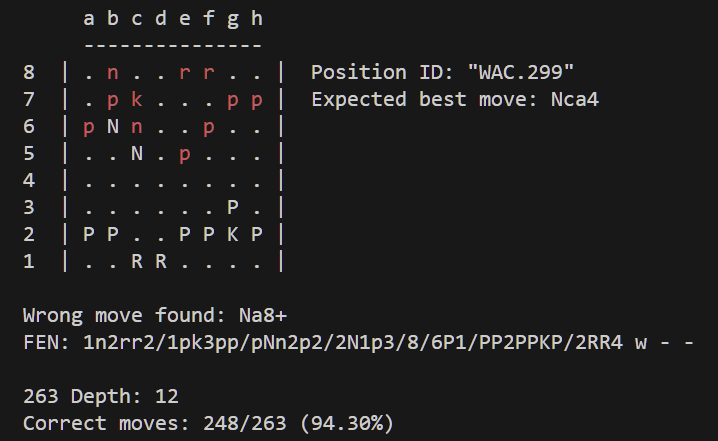

# Chess engine testing: a first look

*Date: November 28, 2023*

After a couple of weeks spent mainly catching crazy bugs, I finally implemented a new important mode in ViperMate: "Test".

Engine testing is necessary for sanity checks and to find bugs and optimizations. At the moment the test mode of ViperMate simply reads an [Extended Position Description](https://www.chessprogramming.org/Extended_Position_Description) file containing positions and best moves. Then the engine searches each position; the best move mentioned in the file is compared to the move found by the engine to calculate a final ratio of correct moves.

## A few caveats and ideas

* Currently ViperMate is slow and its time management logic is almost non-existent, so it doesn't make sense to limit the search by time. At the moment, testing is mainly done to find bugs and unexpected behavior, not to see how well the engine plays. So the search is limited by a fixed depth (12).
* The goal is to test the positions in the [Strategic Test Suite](https://www.chessprogramming.org/Strategic_Test_Suite), but for the first implementation I quickly used the positions in [Win at Chess](https://www.chessprogramming.org/Win_at_Chess). I have excluded the positions with more than one best move, because I want to see how good the engine is at finding the only correct answer.
* I will record the time taken for each search, because I wonder if there is a correlation between errors and computational complexity.
* Besides collecting raw data and statistics, I expect to implement a visual representation of the errors.

## Raw results of the first test

The first runs didn't result in any explosions or horrible segmentation errors.

At depth 12 and using a transposition table of 33,554,432 bytes, 263 positions from WAC were tested and ViperMate found the correct move 248 times, which is 94.30%. These numbers don't say much, but I have to admit that I was more pessimistic before the test.

Here is a screenshot of part of the output. It includes the "fancy board", which I don't think I have shared before.

I have already downloaded several EPD files and I expect working on them in the following weeks.

---

*ViperMate* chess engine by *Enrico Altavilla*