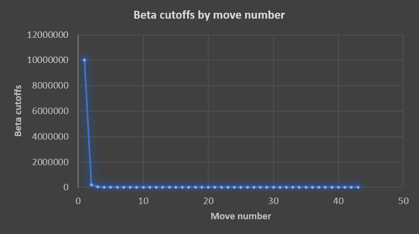
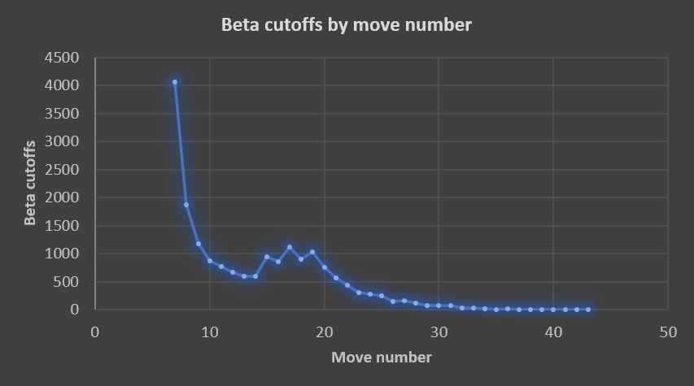
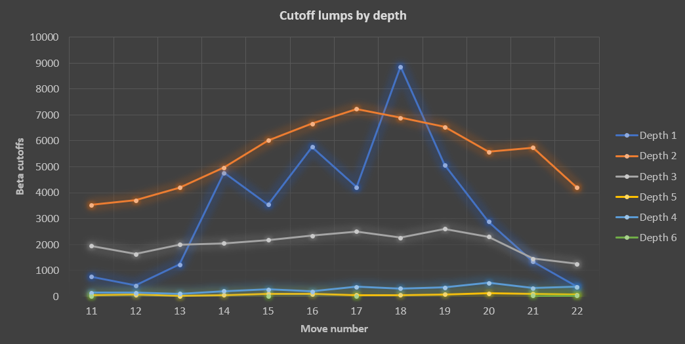

# A curious lump in beta cutoff statistics

*Date: October 13, 2023*

I have noticed a curious lump in the statistics of the beta cutoffs.

I collect statistics about the beta cutoffs taking in consideration at which move of a move list the cutoff happens.

Ideally, most of them should happen at the beginning of the move list, when the best moves are searched first.

This is indeed what happens, as proven in the following chart, which shows the distribution of beta cutoffs by move number happened in **the first moves of a self-play match**:

If we ignore the first moves, though, and zoom a bit on the rest of the chart, we can see a curious lump starting at move 15 or so:

What the hell is that?

After collecting some data, it turns out that the lump is mostly composed by **central pawn moves** (d4, d5, etc.) that, evidently, aren't searched first.

The phenomenon becomes even more evident if we look at the distribution of the beta cutoffs by move number *and by depth*:

**These moves are crying out to be searched first**, but they are not.

Is this actually an issue with move ordering? I don't think so. We are talking about a few thousand moves among tens of millions and the general pruning results seem acceptable to me.

**A quick hack**, done by artificially increasing the score of central pawn moves, shows that this doesn't affect pruning whatsoever, meaning that those central moves are mostly considered within the first moves of a list and that the lump isn't evidence of a general problem with move ordering.

Still, the current quality of opening of ViperMate is *really bad*, mainly because the engine doesn't even attempt to control the center with pawn moves. So, let's take the opportunity to quickly improve the opening.

## Improving the evaluation during the opening

The evaluation function of ViperMater is currently extremely simple. Its positional part is based on the Simplified Evaluation Function piece-square tables, explained [here](https://www.chessprogramming.org/Simplified_Evaluation_Function).

While these tables are acceptable for starting a simple chess programming project, they are not particularly sophisticated. Apparently the weight they give to central pawn moves **is not high enough to lead to a controlled center** in the opening, at least at the search depth I usually run the engine at (8).

The evaluation function is *expected* to behave in a poor way, right now, for at least two reasons:

1. The engine isn't fast enough to approach depth 9+ without having to deal with long calculation times, so a general poor play is expected. 
2. The current evaluation logic requires a serious improvement, for example using better piece-square tables and adding more sophisticated criteria. In the future, it would make sense to consider also a modern evaluation approach based on training a neural network. For all these reasons, I have not invested time into optimizing the existing tables or into improving evaluation.

I have done a quick test to see how things would change: I have tweaked the piece-square table for the pawn, increasing the values of the squares associated to the center of the board.

The modification has led to **a nice French opening** and to a considerably less pronounced prenomenon of central pawn moves being considered too late in the move list.

Unfortunately, it has also increased the search time and the quantity of nodes traversed and evaluated.

Can I consider it an improvement? I'm not sure about that. For sure, the opening has improved a lot, but the new values in the table might somehow introduce bad behaviors or less efficient pruning during other phases of the game, which currently I'm not monitoring. **It's easy to focus on short-term results without considering the more important long-term effects of a decision**.

I've left the old pawn table commented in the source code, in case of second thoughts when I'll start approaching higher depths and more serious evaluations of the engine strength.

## Learned lessons

Studying that lump in data has becomed an opportunity to improve both evaluation and move ordering. It has also been useful to remind myself that the entire evaluation logic needs, sooner or later, to be redesigned.

---

*ViperMate* chess engine by *Enrico Altavilla*